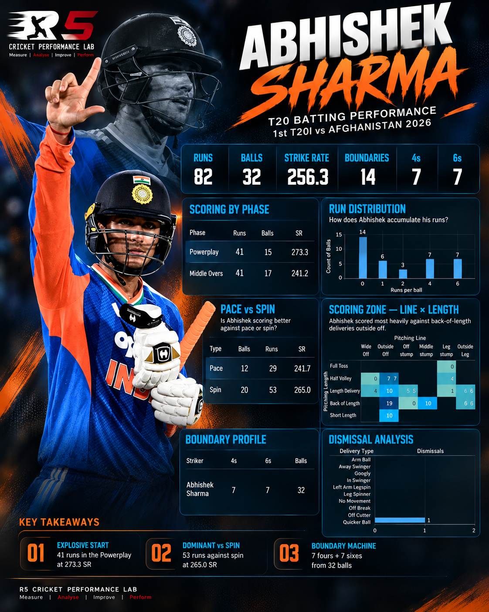

# Abhishek Sharma – 1st T20 vs Afghanistan | Batting Analysis

## Author

**Ramakrishnan Natarajan**  
R5 Cricket Performance Lab

---

## About the Project

This project presents a ball-by-ball T20 batting analysis of Abhishek Sharma's performance in the 1st T20I between India and Afghanistan in 2026.

The analysis goes beyond the basic scorecard to understand how the runs were scored, when they were scored, and which bowling conditions and scoring areas contributed to the innings.

---

## Match Performance

| Metric | Performance |
|---|---:|
| Runs | **82** |
| Balls | **32** |
| Strike Rate | **256.3** |
| Boundaries | **14** |
| Fours | **7** |
| Sixes | **7** |

---

## Analysis Areas

The analysis focuses on:

- Scoring by phase
- Run distribution
- Pace vs spin
- Bowling line
- Bowling length
- Line × length
- Scoring zones

---

## Key Insights

- Scored **82 runs from 32 balls** at a strike rate of **256.3**
- Hit **7 fours and 7 sixes**, contributing significantly to his scoring output
- Analysed his scoring across different phases of the innings
- Compared his performance against pace and spin
- Identified the bowling line and length combinations where he was most effective
- Examined his scoring zones and ball-by-ball scoring patterns

---

## Tools & Methodology

### Tools Used

- Tableau
- Ball-by-ball cricket data
- Data visualization
- Performance analysis

### Methodology

Delivery-level data was analysed to identify scoring patterns across different phases, bowling types, lines, lengths and scoring zones.

---

## Tableau Dashboard

The interactive Tableau dashboard provides a visual breakdown of Abhishek Sharma's innings, including:

- Overall performance
- Phase-wise scoring
- Run distribution
- Pace vs spin
- Line × length analysis
- Scoring zones

**Tableau Public:**  
[View Interactive Tableau Dashboard](https://public.tableau.com/app/profile/ramakrishnan.natarajan6833/viz/AbhishekSharma1stT20vsAFGbattinganalysis/Dashboard1?publish=yes)

---

## Project Files

- `Abhishek Sharma 1st T20 vs AFG batting analysis.twbx` — Tableau workbook
- `README.md` — Project documentation

---

## Objective

The objective of this project was to use ball-by-ball data to understand Abhishek Sharma's batting approach and identify the bowling conditions and scoring areas where he was most effective.

The analysis focuses on:

**Bowling Type → Line → Length → Scoring Outcome → Runs → Strike Rate**

---

## What I Learned

This project helped me explore how ball-by-ball cricket data can be used to analyse a batter beyond traditional scorecard statistics.

I worked with delivery-level data to understand scoring phases, pace versus spin performance, and line-length scoring patterns.

The project also helped me improve my approach to building interactive Tableau dashboards and presenting cricket performance data in a simple and visual format.

---

## Author

**Ramakrishnan Natarajan**

Cricket Analytics | Performance Analysis | Data Analytics
